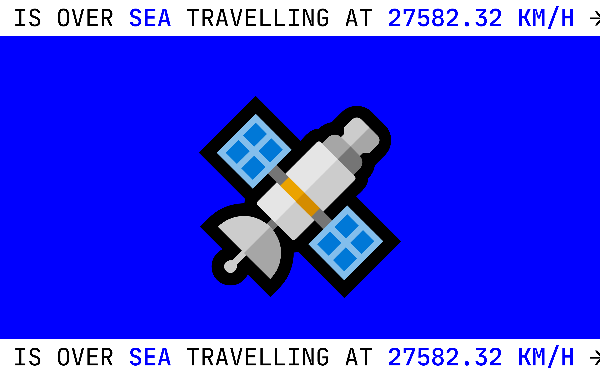
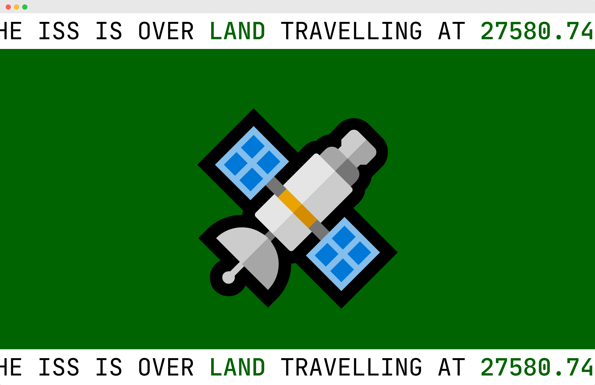
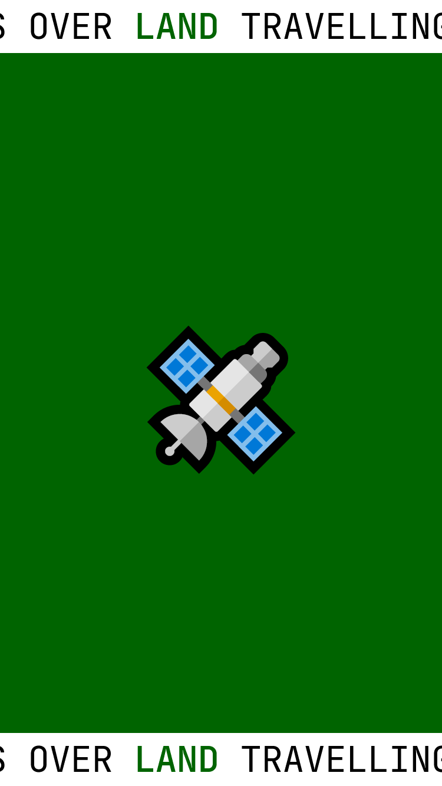
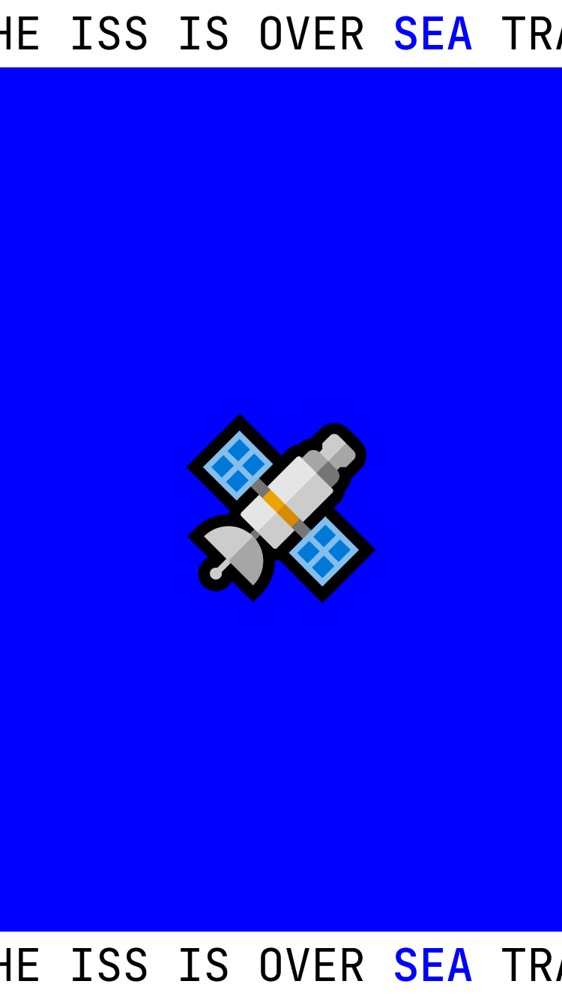

### 🛰️ WHERE IS ISS? 👀

A site that lets you know if the International Space Station is flying over land 🗻 or sea 🌊, and how fast it's travelling.

The background and text colour changes depending on its location, blue for sea, green for sea.

This is the result of a personal challenge to under more about Fetch.

Font by [JetBrainsMono] (https://www.jetbrains.com/lp/mono/)

### 📚 What I learnt
- That `fetch`ed data needs to be maniupulated in the `.then()` methods, because otherwise it's unavailable.. 
- Chaining two `fetch` calls and using the data from each
- It's possible to include working `HTML` in template literals
- How to implement a loading message (sort of)

### 🦺 Testing
- Works on latest version of Firefox, Chrome and Edge
- Does not work on mobile
- Further testing required

### ⏳ Future improvements
- [ ] Add some speed lines / blur onto the emoji
- [ ] Enable users to choose `unit` for speed

### 👀 Screenshots

